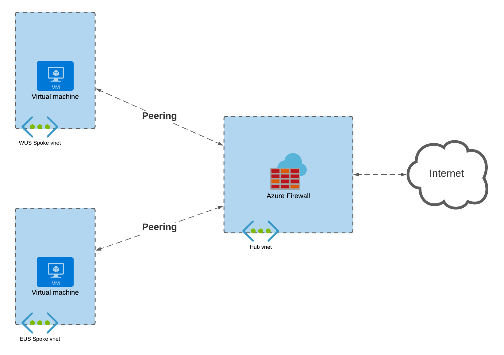

# Azure Firewall with Terraform

Building a test environment to try out Azure firewall.

## Description

This code was written to create the environement described in [John Savill](https://twitter.com/NTFAQGuy)'s excellent video tutorial [Azure Firewall Deep Dive](https://www.youtube.com/watch?v=JiUerkqyW0g)

For simplicity this deployment is in a single Resource Group in a single Region.

## Getting Started

### Dependencies

Written using:
+ Terraform v0.15.1 on windows_amd64
+ provider registry.terraform.io/hashicorp/azurerm v2.72.0

### Installing

It is assumed that you already have Terraform installed and have an Azure account.\
See [here](https://docs.microsoft.com/en-us/azure/developer/terraform/get-started-windows-powershell?tabs=bash) for instructions on how to deploy to Azure with Terraform.

### Executing program

Rename `terraform.tfvars.template` to `terraform.tfvars`\
Make the required changes for your environment\
\
Run `terraform init`\
Run `terrafrom plan`\
Run `terraform apply`\

## Help

## Authors

+ Alex Britton (alex@ahbritton.com)

## License

Distributed under the MIT License. See [LICENSE](https://choosealicense.com/licenses/mit/) for more information.